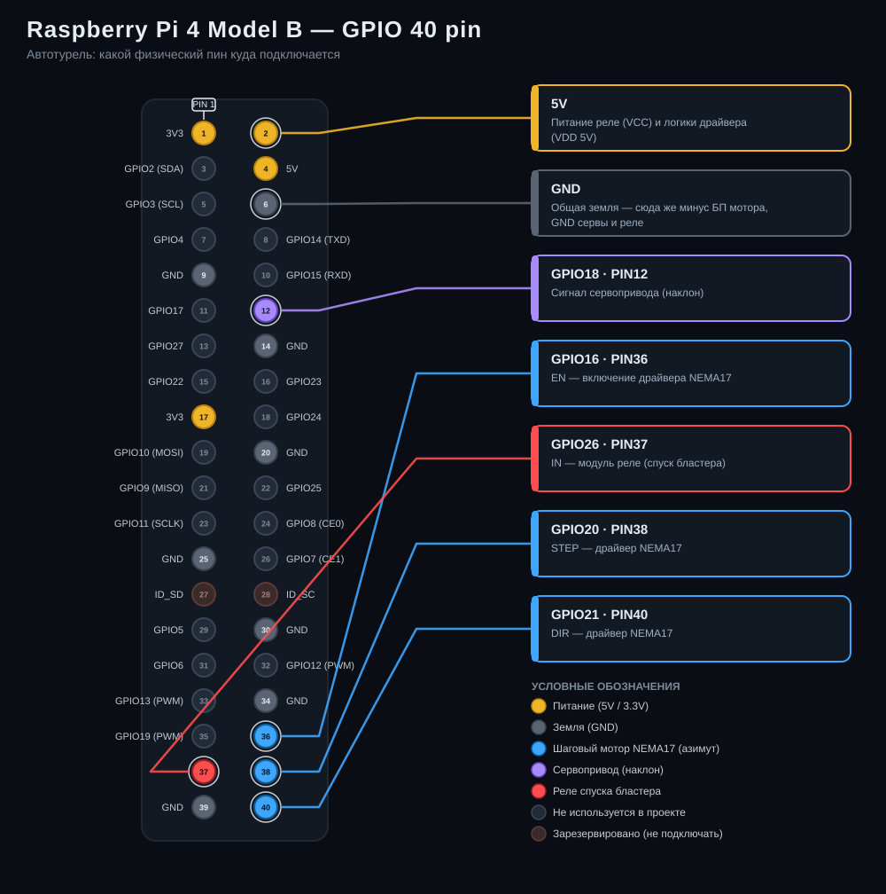

# Автотурель на Raspberry Pi 4

Поворотная платформа с ИИ-слежением за людьми: USB-камера + Raspberry Pi 4
наводят на цель по горизонтали (NEMA17 через STEP/DIR-драйвер) и вертикали
(мини-сервопривод), а веб-интерфейс показывает видео с прицелом и позволяет
управлять турелью с телефона/компьютера в локальной сети. На спуске Nerf-
бластера стоит реле/MOSFET — при захвате цели в режиме АВТО + ВЗВЕДЕНО
турель стреляет автоматически.

## ⚠️ Прежде чем собирать — прочитайте

Этот проект рассчитан **только на поролоновые Nerf-дротики**. Управляющий
код не имеет аппаратных блокировок огня, кроме программного предохранителя
(ВЗВЕДЕНО/НЕ ВЗВЕДЕНО) и аварийной кнопки — этого достаточно для игрушки, но
категорически недостаточно для чего-либо, что может травмировать (страйкбол,
пневматика, тем более огнестрельное оружие). Не переносите этот код на такие
устройства.

Дополнительно:
- Система всегда стартует в состоянии **НЕ ВЗВЕДЕНО** (см. `safety.start_armed`
  в `config.yaml` — не меняйте на `true`).
- Стреляйте только в сторону людей, которые в курсе и согласны (или по
  мишеням/манекенам). Рекомендуются защитные очки для всех в зоне действия.
- Не оставляйте турель включённой и взведённой без присмотра.
- Добавьте физический выключатель в цепь питания реле/бластера как резервный
  способ обесточить выстрел независимо от софта.
- Ограничитель поворота (`soft_limit_steps`) и лимит времени намотки
  (`max_continuous_fire_seconds`) — это защита проводов и механики, а не
  замена здравому смыслу при сборке корпуса.

## Что понадобится

| Узел | Компонент |
|---|---|
| Мозги | Raspberry Pi 4 |
| Камера | Любая USB (UVC) веб-камера — Razer Kiyo и т.п. |
| Поворот (азимут) | Шаговый мотор NEMA17 + драйвер STEP/DIR (A4988 / DRV8825 / TMC2209) |
| Наклон (угол места) | Небольшой сервопривод (SG90 — для лёгкого бластера; для более тяжёлого лучше MG90S/DS3218 с металлическими шестернями и большим моментом) |
| Спуск | Модуль реле или MOSFET, подключённый в цепь кнопки спуска бластера |
| Питание | Отдельный БП для NEMA17 и моторчиков бластера (НЕ от 5V Pi — просадка питания перезагружает Pi) |
| Механика | Штатив/корпус пан-тилт, крепление камеры как можно ближе к оси ствола |

## Пошаговая схема подключения (куда что втыкать)



Разъём показан как он есть физически (2 ряда по 20 пинов, PIN 1 отмечен
сверху) — так проще сверяться, глядя на реальную плату. Дальше — то же самое
текстом, по шагам.

### 1. Питание — сначала главное

Никогда не питайте NEMA17 и моторчик/соленоид бластера от 5V-выхода
Raspberry Pi — просадка тока перезагрузит или сожжёт Pi. Нужен отдельный
блок питания под шаговый мотор (обычно 9–24V, смотрите даташит вашего
драйвера и самого NEMA17) и, желательно, отдельное питание 5–6V для
сервопривода, если он будет держать вес бластера.

**Все GND (минусы) должны быть объединены в одну точку**: GND Raspberry Pi
— логический GND драйвера шагового мотора — GND сервопривода — GND модуля
реле — минус отдельных блоков питания. Без общей земли сигналы STEP/DIR/PWM
будут «плавать», и мотор/серва будут дёргаться или не слушаться команд.

### 2. Шаговый мотор NEMA17 + драйвер (азимут, влево-вправо)

**Логическая сторона драйвера** (A4988 / DRV8825 / TMC2209):
- `STEP` → Raspberry Pi **GPIO20**
- `DIR` → Raspberry Pi **GPIO21**
- `EN` (Enable) → Raspberry Pi **GPIO16**
- `GND` (логический) → GND Raspberry Pi
- питание логики драйвера (`VDD`) → 3.3V или 5V Raspberry Pi (уточните по
  даташиту вашего драйвера — у A4988/DRV8825 обычно 3–5.5V)

**Силовая сторона драйвера:**
- `VMOT` → «+» отдельного блока питания под мотор
- `GND` (силовой) → «−» того же блока питания, и обязательно соединить с
  общей землёй проекта
- между `VMOT` и `GND` желателен конденсатор ≥47 мкФ (на многих платах
  драйвера он уже впаян)

**Обмотки мотора:** 4 провода NEMA17 (две пары — A+/A−, B+/B−) →
выходные клеммы `1A/1B/2A/2B` (или `A+/A−/B+/B−`) на драйвере. Если не
знаете распиновку своего мотора — прозвоните её мультиметром (у проводов
одной обмотки есть сопротивление друг с другом, у проводов разных обмоток —
нет) или посмотрите даташит.

**Не забудьте:**
- Подстроечным резистором на драйвере выставьте ток, соответствующий
  вашему NEMA17 (обычно указан на шильдике мотора, например 1.2–1.7A на
  фазу) — иначе мотор будет греться или пропускать шаги.
- DIP-переключатели микрошага (есть на DRV8825/TMC2209) задают, сколько
  шагов приходится на один оборот — от этого зависит `soft_limit_steps` в
  `config.yaml`.

### 3. Сервопривод (наклон, вверх-вниз)

- Сигнальный провод (обычно оранжевый/жёлтый) → Raspberry Pi **GPIO18**
  (аппаратный PWM)
- «+» (красный) → отдельное 5V питание. Если серва держит вес бластера,
  5V-пина Pi может не хватить по току, и Pi будет перезагружаться под
  нагрузкой — используйте внешний BEC/блок питания.
- «−»/GND (коричневый/чёрный) → общая земля проекта (и Pi, и блока питания
  серво)

### 4. Спуск Nerf-бластера (реле/MOSFET)

- `IN` модуля реле → Raspberry Pi **GPIO26**
- `VCC` модуля реле → 5V Raspberry Pi
- `GND` модуля реле → общая земля
- `COM`/`NO` (нормально разомкнутые) контакты реле врезаются в электрическую
  цепь штатной кнопки спуска бластера — обычно можно подключиться параллельно
  контактам кнопки: при замыкании реле имитирует нажатие. Если бластер
  полностью механический (без электропривода/моторчиков), потребуется
  доработать его моторчиком-досылателем — одним реле такой бластер не
  «нажать».
- Обязательно поставьте **физический тумблер** в разрыв этой цепи (в цепи
  питания реле или между реле и бластером) — это аппаратный предохранитель,
  который работает независимо от софта.

### 5. Камера

Просто воткните USB-камеру (Razer и т.п.) в любой USB-порт Pi4 — это
стандартное UVC-устройство, дополнительные драйверы не нужны. Расположите
её на турели как можно ближе к оси ствола бластера, чтобы минимизировать
параллакс между тем, что видит камера, и тем, куда полетит дротик.

### Итоговая распиновка (BCM) — сводная таблица

Всё это можно поменять в `config.yaml`.

| Сигнал | GPIO (BCM) |
|---|---|
| STEP (NEMA17) | 20 |
| DIR (NEMA17) | 21 |
| ENABLE (NEMA17) | 16 |
| Сервопривод (наклон) | 18 (аппаратный PWM) |
| Реле/MOSFET спуска | 26 |

## Установка

```bash
cd turret
python3 -m venv .venv
source .venv/bin/activate
pip install -r requirements.txt

# Плавный PWM/шаги через pigpio (рекомендуется):
sudo apt install -y pigpio
sudo systemctl enable --now pigpiod
```

Веса детектора людей скачивать вручную не обязательно — `main.py` сам
скачивает их при первом запуске (нужен интернет в этот момент). Если хотите
подготовить их заранее (например, у Pi не будет доступа в интернет) —
запустите `./scripts/download_model.sh` до первого старта, см. раздел ниже.

Проверьте камеру: `ls /dev/video*` и/или `v4l2-ctl --list-devices`. Если
индекс не `0`, поправьте `camera.index` в `config.yaml`.

## Веса детектора: кэш и офлайн-режим

При каждом запуске `main.py`:

1. **Файлы весов уже лежат в `models/`** (обычный случай после первого
   запуска, в т.ч. после выключения/включения без интернета) — используются
   как есть, сеть вообще не трогается. Работает по localhost полностью офлайн.
2. **Файлов нет** (первый запуск, или их удалили) — пробует скачать с
   `detection.prototxt_url` / `detection.model_url` из `config.yaml`.
   Получилось — сохраняет в `models/` и дальше всегда берёт их оттуда (пункт 1).
3. **Скачать не удалось** (нет интернета, DNS недоступен и т.п.) — турель всё
   равно запускается, веб-интерфейс работает, но режим АВТО заблокирован
   (кнопка неактивна, в интерфейсе предупреждение «Нет весов детектора»).
   Доступны ручное наведение джойстиком, ЦЕНТР, ручной ОГОНЬ и АВАРИЙНЫЙ
   СТОП — просто без автослежения. Как только веса появятся (дать Pi
   интернет и перезапустить `main.py`/сервис, или вручную положить файлы,
   или прогнать `./scripts/download_model.sh` с другого компьютера и
   скопировать результат в `models/`) — при следующем запуске режим АВТО
   станет доступен.
4. Если файлы в `models/` есть, но повреждены или несовместимы с
   установленной версией OpenCV — то же самое: лог предупредит и турель
   поднимется в ручном режиме, а не упадёт.

Ручной способ (`deploy.prototxt` и `mobilenet_iter_73000.caffemodel` из
репозитория `chuanqi305/MobileNet-SSD`, положить в `models/` под именами
`MobileNetSSD_deploy.prototxt` / `MobileNetSSD_deploy.caffemodel`) по-прежнему
работает как запасной вариант, если автоматическое скачивание почему-либо не
подходит.

## Запуск

```bash
python main.py
```

Откройте `http://<IP-адрес-Pi>:8080` в браузере (в той же сети).

Автозапуск при загрузке — пример юнита в `systemd/turret.service` (поправьте
пути и пользователя под себя):

```bash
sudo cp systemd/turret.service /etc/systemd/system/
sudo systemctl daemon-reload
sudo systemctl enable --now turret.service
```

## Интерфейс

- **Видео** с прицелом по центру кадра, рамками найденных людей и подписью
  «ЗАХВАТ», когда цель захвачена.
- **Переключатель ВЗВЕДЕНО / НЕ ВЗВЕДЕНО** — большая кнопка состояния. При
  переводе во взведённое состояние спрашивает подтверждение в браузере (не
  выстрелит без явного взвода).
- **АВТО / РУЧНОЙ** — в режиме РУЧНОЙ турель не стреляет и не наводится сама,
  детекция людей приостанавливается, движение — только джойстиком. Кнопка
  АВТО неактивна и под ней виден предупреждающий текст, если не загружены
  веса детектора (см. «Веса детектора: кэш и офлайн-режим» выше).
- **Джойстик** (активен в режиме РУЧНОЙ) — тяните от центра, отпустите —
  останов.
- **ЦЕНТР** — сброс азимута в 0 (программно, без концевиков — перед стартом
  выставьте платформу по центру руками) и наклона в `center_angle`.
- **ОГОНЬ** — ручной одиночный выстрел (нужно взвести, действует лимит
  `cooldown_ms`).
- **АВАРИЙНЫЙ СТОП** — сразу гасит цепь спуска, снимает взвод, останавливает
  поворот и переводит в режим РУЧНОЙ.

## Настройка слежения

Всё — в `config.yaml`, секция `tracking`:

- `pan_kp/pan_kd`, `tilt_kp/tilt_kd` — коэффициенты ПИД по азимуту/наклону.
  Начните с готовых значений; увеличивайте `kp`, если турель «вяло» доводит
  цель к центру, увеличивайте `kd`, если её «колбасит» (перерегулирование).
- `lock_threshold_px` — насколько близко к центру должен быть центр цели,
  чтобы считаться захваченной.
- `lock_frames_required` — сколько кадров подряд цель должна быть в захвате
  перед выстрелом (защита от случайного дёрганого срабатывания).

Помните про параллакс: камера и ствол разнесены физически, так что точка
прицеливания и точка попадания совпадают только на той дистанции, на которой
вы откалибровали крепление. Протестируйте на реальной дистанции стрельбы по
неподвижной мишени перед тем, как включать взвод по живым целям.

## Устранение неполадок

- **Камера не открывается** — не тот `camera.index`; попробуйте `0`, `1`…
  и проверьте, что камера не занята другим процессом.
- **Низкий FPS** — уменьшите `camera.width/height`; детектор всё равно
  ресайзит кадр в 300×300, но декодирование большого кадра само по себе
  небесплатно.
- **Дёргается сервопривод** — почти всегда решается переходом на pigpio
  (`pin_factory: "pigpio"` + запущенный `pigpiod`); программный PWM без него
  подвержен джиттеру.
- **Шаговик не крутится / гудит на месте** — проверьте подстроечный
  резистор тока на драйвере, порядок подключения катушек и что
  `enable_active_low` соответствует вашему драйверу.
- **Стреляет без остановки / залипание** — для этого и нужен физический
  выключатель в цепи реле; программный `max_continuous_fire_seconds` —
  последняя линия защиты, а не единственная.

## Возможные доработки (не реализовано)

- Более точный/быстрый детектор — YOLOv8n, экспортированный в NCNN/TFLite,
  вместо MobileNet-SSD (выше точность и FPS на Pi4, но сложнее сборка
  зависимостей). Достаточно заменить `PersonDetector.detect()` на другую
  реализацию с тем же интерфейсом (список `Detection`).
- Концевики/датчики на осях для настоящего homing вместо ручного центрирования.
- Более быстрая генерация STEP-импульсов через `pigpio`-волны вместо цикла на
  Python, если понадобится более резкое слежение за быстро движущейся целью.
