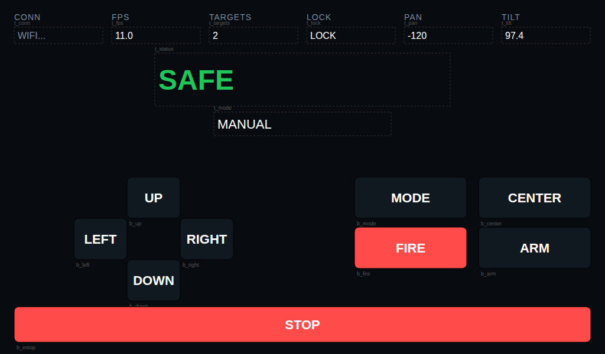

# Экран Nextion — точная спецификация (координаты и цвета уже посчитаны)

Превью того, что получится (сгенерировано по тем же точным координатам и
цветам, что в таблицах ниже — не скриншот реального Nextion Editor, а
проверка раскладки на отсутствие наложений/косяков):

Ниже — не "придумайте расположение", а конкретные числа для каждого поля в
Nextion Editor. Задача — скопировать значения из таблиц в свойства
компонентов, ничего не решая самостоятельно. Цвета взяты из той же палитры,
что и в браузерном веб-интерфейсе турели (`app/web/static/style.css`), так
что пульт и веб-версия будут выглядеть как один и тот же продукт.

Расчёт координат сделан под холст **1024×600** (наиболее вероятное
разрешение `NX1060P101-011C-1`, см. README). Если у вашего экрана другое
разрешение — все размеры нужно будет пропорционально пересчитать (либо просто
уменьшить масштаб компонентов на глаз внутри редактора, сохраняя их
взаимное расположение).

Скачать Nextion Editor: официальный сайт Nextion (`nextion.tech`) →
Download. Только Windows; на Linux/Mac — через Wine.

## 0. Новый проект и шрифты

1. `File → New`. Разрешение — 1024×600 (или ближайшее доступное для вашей
   модели в списке).
2. Фон страницы (Page → атрибут `bco`) — **2146** (почти чёрный с лёгким
   синим оттенком, как фон веб-интерфейса).
3. `Tools → Font Generator` — сгенерируйте 3 шрифта (потребуются для разных
   элементов ниже), для каждого: любой системный шрифт (подойдёт Arial),
   Encoding можно оставить по умолчанию (нам нужна только латиница):
   - Шрифт **0**: размер ~16px — для мелких подписей (CONN, FPS...)
   - Шрифт **1**: размер ~26px — для кнопок и значений телеметрии
   - Шрифт **2**: размер ~48px — для главного индикатора состояния
   После генерации — "Add to HMI" (или аналогичная кнопка) для каждого,
   они появятся в списке шрифтов проекта под номерами 0/1/2.

## 1. Кнопки — 9 штук

Компонент **Button** (`b`), перетащить на страницу, задать в панели
атрибутов (Attribute): `objname`, `id`, `txt`, `x`, `y`, `w`, `h`, `bco`
(цвет фона), `pco` (цвет текста), `font` — все значения из таблицы ниже.
**Дополнительно для КАЖДОЙ кнопки**: вкладки Touch Press Event и Touch
Release Event → включить галочку **"Send Component ID"** (без этого пульт
не узнает о нажатии/отпускании).

| objname | id | txt | x | y | w | h | bco | pco | font |
|---|---|---|---|---|---|---|---|---|---|
| b_up | 3 | UP | 215 | 300 | 90 | 70 | 4292 | 65535 | 1 |
| b_down | 4 | DOWN | 215 | 440 | 90 | 70 | 4292 | 65535 | 1 |
| b_left | 5 | LEFT | 125 | 370 | 90 | 70 | 4292 | 65535 | 1 |
| b_right | 6 | RIGHT | 305 | 370 | 90 | 70 | 4292 | 65535 | 1 |
| b_mode | 2 | MODE | 600 | 300 | 190 | 70 | 4292 | 65535 | 1 |
| b_center | 7 | CENTER | 810 | 300 | 190 | 70 | 4292 | 65535 | 1 |
| b_fire | 8 | FIRE | 600 | 385 | 190 | 70 | 64105 | 65535 | 1 |
| b_arm | 1 | ARM | 810 | 385 | 190 | 70 | 4292 | 65535 | 1 |
| b_estop | 9 | STOP | 24 | 520 | 976 | 60 | 64105 | 65535 | 2 |

`b_up/b_down/b_left/b_right` вместе образуют крест (джойстик из 4 кнопок) —
между ними специально оставлен зазор под пустую центральную клетку, ничего
докладывать туда не нужно. `b_estop` — на всю ширину внизу, самая заметная
кнопка на экране.

## 2. Текстовые поля со значениями — 8 штук

Компонент **Text** (`t`). Здесь `id` не важен (прошивка адресует их по
имени, не по id), но `objname` должен совпадать **точно, с учётом
регистра**.

| objname | x | y | w | h | pco | font | начальный txt |
|---|---|---|---|---|---|---|---|
| t_conn | 24 | 46 | 150 | 28 | 31827 | 1 | WIFI... |
| t_fps | 189 | 46 | 150 | 28 | 65535 | 1 | 0 |
| t_targets | 354 | 46 | 150 | 28 | 65535 | 1 | 0 |
| t_lock | 519 | 46 | 150 | 28 | 65535 | 1 | - |
| t_pan | 684 | 46 | 150 | 28 | 65535 | 1 | 0 |
| t_tilt | 849 | 46 | 150 | 28 | 65535 | 1 | 0 |
| t_status | 262 | 90 | 500 | 90 | 9771 | 2 | SAFE |
| t_mode | 362 | 190 | 300 | 40 | 65535 | 1 | MANUAL |

`t_status` — главный индикатор, самый крупный шрифт на экране. Прошивка
сама переключает и текст, и цвет (`.pco`) между зелёным (SAFE) и красным
(ARMED) в реальном времени — начальный цвет 9771 (зелёный) просто для
вида при первом включении, до первого ответа от Pi.

## 3. Статические подписи — 6 штук (необязательно, но красивее)

Обычный **Text**, `objname` не важен (можно оставить, что предложит
редактор), прошивка их не трогает — впишите `txt` один раз и всё.

| txt | x | y | w | h | pco | font |
|---|---|---|---|---|---|---|
| CONN | 24 | 20 | 150 | 18 | 31827 | 0 |
| FPS | 189 | 20 | 150 | 18 | 31827 | 0 |
| TARGETS | 354 | 20 | 150 | 18 | 31827 | 0 |
| LOCK | 519 | 20 | 150 | 18 | 31827 | 0 |
| PAN | 684 | 20 | 150 | 18 | 31827 | 0 |
| TILT | 849 | 20 | 150 | 18 | 31827 | 0 |

## 4. Порт и скорость UART

Через `Tools → Comm` (или в свойствах страницы `Program.s`) убедитесь, что
baud rate — **9600** (заводское значение Nextion). Если меняли — либо
верните на 9600, либо поменяйте `NEXTION_BAUD` в файле
`esp32_nextion_remote.ino` под то же значение, что стоит на экране.

## 5. Компиляция и загрузка на экран

1. `File → Compile` — получите `*.tft` в папке проекта.
2. Скопируйте `.tft` на microSD-карту (в корень, без папок).
3. Выключите дисплей, вставьте карту, включите — экран сам предложит
   прошиться (меньше минуты).
4. Выключите, выньте карту, включите заново уже без неё.

## Цветовая палитра (RGB565), если захотите что-то поменять

| Цвет | RGB565 | Как в веб-интерфейсе |
|---|---|---|
| Фон страницы | 2146 | `--bg` #0a0e14 |
| Фон панели/кнопки | 4292 | `--panel` #131922 |
| Акцентный синий | 15679 | `--accent` #3ea6ff |
| Безопасно (зелёный) | 9771 | `--safe` #22c55e |
| Опасно (красный) | 64105 | `--danger` #ff4d4f |
| Подтверждение (янтарный) | 62885 | — |
| Белый текст | 65535 | чистый белый — упрощение от `--text` #e6edf3 (тот даёт 59262, разница на глаз незаметна) |
| Приглушённый текст | 31827 | `--muted` #7d8a9a |

## О кириллице

Все подписи выше — латиницей намеренно (как и "LOCK" в оверлее на видео в
веб-интерфейсе): шрифты Nextion не содержат кириллицу, пока вы явно не
сгенерируете её в Font Generator с диапазоном Unicode для русского языка.
Хотите русский текст — сгенерируйте такой шрифт отдельно, привяжите к
нужным компонентам, и поменяйте строки в `esp32_nextion_remote.ino`
(вызовы `nxSetText(...)` и `.txt=` в таблицах выше) на кириллицу. Это
отдельный необязательный шаг, протокол касаний/команд от него не зависит.
